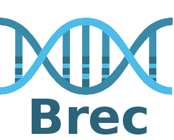

BREC is an automated, bioinformatic and non-genome-specific solution based on the Marey maps method in order to provide local recombination rate estimates. Then, identify the chromatin boundaries along chromosomes. This functionality allows determinig the location of the peri/centromeric and telomeric regions known to present a reduced recombination rate in most genomes.

# Installation

Since Brec is a Biocundoctor package, installing Bioconductor is the first step towards using Brec. 

### Bioconductor

<b> [What is Bioconductor ?](https://bioconductor.org/)</b>

To install Bioconductor, start R (version "3.5") and enter:


```r
if (!requireNamespace("BiocManager", quietly = TRUE))
    install.packages("BiocManager")
```

For older versions of R (< 3.5.0):


```r
install.packages("rJava")
source("https://bioconductor.org/biocLite.R")
library(BiocInstaller)
```

Further details and installation guide are available <em> [here](https://bioconductor.org/install/)</em>

## Install Brec package from Bioconductor 


```r
# install.packages("/Brec/Brec_0.1.0.tar.gz",repos = NULL, type="source")

# For R (version "3.5") 
BiocManager::install("Brec")

# For R  (< 3.5.0)
BiocInstaller::biocLite("Brec")
```

# Run Brec


```r
library(Brec)
Brec_chromosome(genomeName, inputChrID,  separator, physicalMapUnit, data_by_chr_arms)
```

## Understand Brec parameters 

genomeName : string of the name of the genome (organism) forwhich the data is provided. This will be used for output and plot file names.
	Default value is an empty string "".

inputChrID : numeric or character value which identifies the chromosome to be processed.
   no default value is available.    

separator : string for the character used for seperating values in the input data file.
	Default value is tab "\\t"
	options : "," / ";" / " " 

physicalMapUnit : the measurement unit used for the physical map in the input data file.
	Default value is megabase pair "Mb"
	options: basepair "bp"

data_by_chr_arms : boolean value indicating wheather the genome data is provided by chromosomal arms (TRUE) or whole chromosomes (FALSE).
	Default value is FALSE

## Run Brec on a sample genome dataset: <em> Drosophila melanogaster R6 </em> 


```r
Brec_chromosome(genomeName = "Drosophila_melanogaster_R6", inputChrID = 2, dataByChrArms = TRUE)
```

# Understand Brec results 

pic of prompt choose.file dialogue box + input data file sample

show results + stats in console

+ outout files sample 

### Interactive plots generated by Brec


### Tips for reading and visualizing interactive plots 

# Run Brec from GUI

# Dependencies 

In order to run Brec, the following installations are needed:

### Pandoc

Pandoc is needed for html rendering of the interactive plots generated by plotly/R as an output for Brec.

Further details and installation guide are available <em> [here](https://pandoc.org/installing.html)</em>

No need for Pandoc if you are running Brec from Rstudio 

```
$ sudo apt install haskell-platform
$ sudo dpkg -i pandoc-2.4-1-amd64.deb
```

### Orca

Orca is needed for exporting plotly interactive plots (objects) as static images to be saved as png.

Install from <em> [here](https://github.com/plotly/orca#installation)</em>

```


